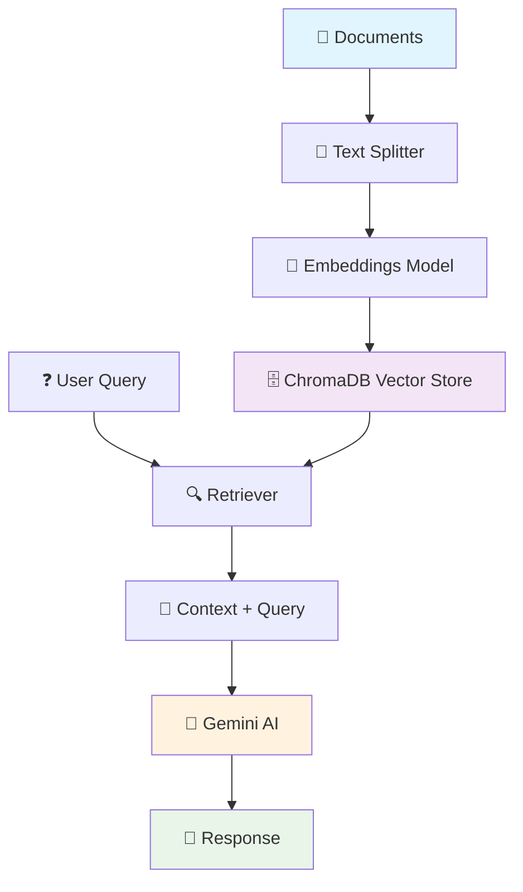

# 🧠 DocuMind
### *Intelligent Document Conversations Powered by RAG*

<div align="center">


*Transform your documents into an intelligent conversational AI that understands context, retrieves relevant information, and provides accurate answers.*

[🚀 Quick Start](#-quick-start) • [✨ Features](#-features) • [🛠️ Installation](#️-installation) • [📖 Usage](#-usage) • [🎯 Demo](#-demo)

</div>

---

## 🌟 What is DocuMind?

DocuMind is a cutting-edge **Retrieval-Augmented Generation (RAG)** chatbot that brings your documents to life. Instead of searching through endless files, simply ask questions in natural language and get intelligent, contextual answers backed by your actual document content.

### 🎯 Perfect For:
- **📋 Policy Documents** - HR policies, procedures, guidelines
- **📊 Technical Specs** - Product manuals, API documentation
- **📚 Knowledge Bases** - FAQs, troubleshooting guides
- **🔍 Research Papers** - Academic documents, reports
- **💼 Business Documents** - Contracts, proposals, SOPs

---

## ✨ Features

### 🤖 **Intelligent Conversations**
- Natural language understanding with Google Gemini AI
- Context-aware responses based on document content
- Handles complex queries across multiple document types

### 🔍 **Advanced Document Processing**
- **Vector Embeddings** with Sentence Transformers
- **Semantic Search** using ChromaDB vector database
- **Smart Chunking** for optimal context retrieval
- **Multi-format Support** (TXT, PDF, and more)

### 🎨 **Beautiful Web Interface**
- Modern, responsive chat UI
- Real-time typing indicators
- Mobile-friendly design
- Gradient themes and smooth animations

### ⚡ **High Performance**
- Fast vector similarity search
- Efficient document indexing
- Scalable architecture
- Local deployment ready

---

## 🛠️ Installation

### Prerequisites
- Python 3.8 or higher
- Google API key for Gemini AI

### 1. Clone the Repository
```bash
git clone <your-repo-url>
cd documind
```

### 2. Install Dependencies
```bash
pip install -r requirements.txt
```

### 3. Set Up Environment
Create a `.env` file in the root directory:
```env
GOOGLE_API_KEY=your_google_api_key_here
```

### 4. Prepare Your Documents
Place your documents in the `data/` folder or run the Jupyter notebook to create sample data:
```bash
jupyter notebook Notebook/document.ipynb
```

---

## 🚀 Quick Start

### Option 1: Easy Launch (Recommended)
```bash
python run_chatbot.py
```

### Option 2: Direct Flask Run
```bash
python app.py
```

### 3. Open Your Browser
Navigate to `http://localhost:5000` and start chatting with your documents!

---

## 📖 Usage

### 💬 Sample Conversations

**You:** *"How many days can I work remotely?"*  
**DocuMind:** *"According to the Remote Work Policy, employees may work remotely up to 3 days per week with manager approval. Core working hours are 10:00–16:00 local time."*

**You:** *"What are the Aurora X1 headphone specifications?"*  
**DocuMind:** *"The Aurora X1 headphones feature 40mm neodymium drivers, 20Hz–40kHz frequency response, Bluetooth 5.3 + 3.5mm wired connectivity, and 75h battery life (ANC off) or 45h (ANC on)."*

### 🎯 Pro Tips
- Ask specific questions for better results
- Reference document names or topics
- Use natural language - no need for keywords
- Try follow-up questions for deeper insights

---

## 🏗️ Architecture



### 🔧 Tech Stack
- **Backend:** Flask, LangChain, ChromaDB
- **AI/ML:** Google Gemini, Sentence Transformers
- **Frontend:** HTML5, CSS3, Vanilla JavaScript
- **Vector Store:** ChromaDB with persistence
- **Embeddings:** HuggingFace all-MiniLM-L6-v2

---

## 📁 Project Structure

```
documind/
├── 🚀 app.py                 # Flask web server
├── 🎮 run_chatbot.py         # Easy startup script
├── 📋 requirements.txt       # Dependencies
├── 🎨 templates/
│   └── index.html           # Chat interface
├── 📓 Notebook/
│   ├── document.ipynb       # RAG implementation
│   └── chroma_db/           # Vector database
├── 📂 data/                 # Your documents
└── 📖 README.md             # This file
```

---

## 🎯 Demo

### 🖥️ Desktop Experience


### 📱 Mobile Experience  


---

## 🔧 Customization

### 🎨 **Change the Theme**
Edit the CSS variables in `templates/index.html`:
```css
:root {
    --primary-gradient: linear-gradient(135deg, #your-color1, #your-color2);
    --chat-bg: #your-background-color;
}
```

### 🤖 **Switch AI Models**
Modify the LLM in `app.py`:
```python
llm = ChatGoogleGenerativeAI(
    model="gemini-1.5-pro",  # or gemini-1.5-flash
    temperature=0.1          # Adjust creativity (0-1)
)
```

### 📝 **Custom System Prompt**
Update the assistant behavior:
```python
system_prompt = """You are DocuMind, a helpful AI assistant specialized in 
analyzing documents and providing accurate, contextual answers..."""
```

---

## 🚀 Advanced Features

### 📊 **Analytics Dashboard** (Coming Soon)
- Query analytics and popular questions
- Document usage statistics
- Response accuracy metrics

### 🔐 **Authentication** (Roadmap)
- User login and session management
- Role-based access control
- Document permissions

### 🌐 **Multi-language Support** (Planned)
- Support for multiple languages
- Automatic language detection
- Translated responses

---

## 🤝 Contributing

We welcome contributions! Here's how you can help:

1. 🍴 Fork the repository
2. 🌿 Create a feature branch (`git checkout -b feature/amazing-feature`)
3. 💾 Commit your changes (`git commit -m 'Add amazing feature'`)
4. 📤 Push to the branch (`git push origin feature/amazing-feature`)
5. 🔄 Open a Pull Request

### 🐛 Found a Bug?
Please open an issue with:
- Clear description of the problem
- Steps to reproduce
- Expected vs actual behavior
- System information

---

## 📄 License

This project is licensed under the MIT License - see the [LICENSE](LICENSE) file for details.

---

## 🙏 Acknowledgments

- **LangChain** for the amazing RAG framework
- **Google** for the powerful Gemini AI
- **ChromaDB** for efficient vector storage
- **HuggingFace** for open-source embeddings
- **Flask** for the lightweight web framework

---

<div align="center">

### 🌟 Star this repo if DocuMind helped you! 

**Made with ❤️ by [Your Name]**

[⬆ Back to Top](#-documind)

</div>